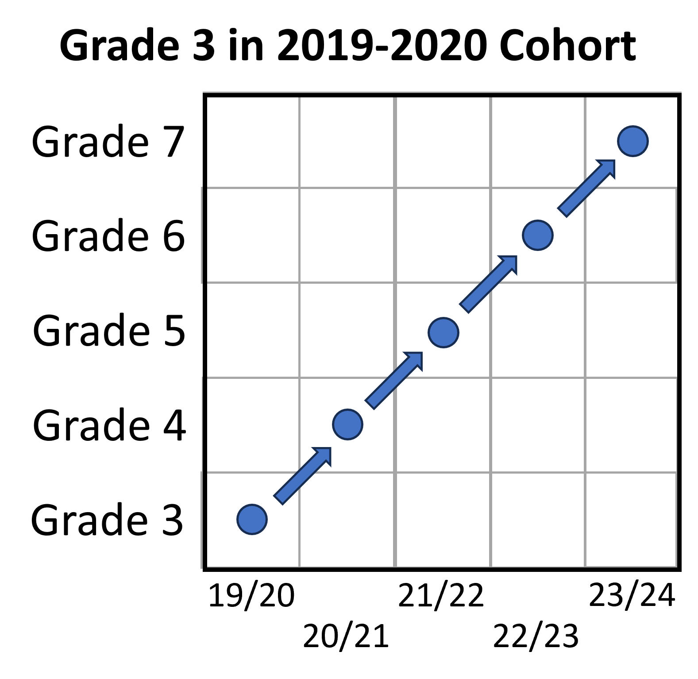

```{r setup}
#| echo: false
#| warning: false

library(cohortED)
library(ggplot2)
library(cowplot)
library(knitr)
library(kableExtra)

```

```{r user_input}
#| echo: false

input_dataset <- math

```

## Overview

```{r setup-overview}
#| include: false

years <- parse_year(input_dataset$YEAR)
latest_year <- max(years, na.rm = TRUE)
earliest_year <- min(years, na.rm = TRUE)

latest_label <- to_academic_year(latest_year)
earliest_label <- to_academic_year(earliest_year)
year_str <- paste(earliest_label, "to", latest_label)

content_area <- attr(input_dataset, "content_area")
record_type <- attr(input_dataset, "record_type")
data_source <- attr(input_dataset, "data_source")
num_students <- format(length(unique(input_dataset$ID)), big.mark = ",")

```

```{r overview-text}
#| echo: false
#| results: asis

cat(paste0(
  "This short report summarizes trends in student cohorts and mobility, focusing on participation in the state *",
  tolower(content_area), "* assessment during the *", latest_label, "* academic year. ",
  "While *", latest_label, "* serves as the primary lens, the dataset spans from *", year_str,
  "*, allowing for the identification of longer-term patterns across academic years. ",
  "The analysis is based on the presence or absence of individual *", record_type, "*s in each year, ",
  "which serves as a proxy for enrollment or participation. ",
  "However, it may not fully capture students represented in the system in other ways—such as through partial-year enrollment ",
  "or administrative records without assessment data—and therefore may underrepresent true enrollment. ",
  "Future analyses may benefit from incorporating dedicated enrollment records for more complete insights. ",
  "This report draws on *", num_students, "* unique students from the `", data_source, "` dataset."
))

```

## Student Population

```{r student_population}
#| echo: false

student_population <- summarize_students_by_grade_year(dataset = input_dataset)

```

This section provides an overview of the available student data, including enrollment counts by grade and year. These figures establish the foundation for understanding cohort patterns, mobility trends, and the scope of analysis in subsequent sections.

```{r student_report}
#| echo: false
#| results: asis

# Combine your static sentence with the output paragraph
full_text <- paste0(
  "The table below provides the number of students by year and grade levels based on the available data. ",
  report_students_by_grade_year(student_population)$Paragraph_Detailed
)

cat(full_text)

```


```{r student_table}
#| echo: false

kable(student_population$Summary_Wide, 
      caption = student_population$Caption, 
      align = "l")

```

```{r student_lines}
#| echo: false

print(student_population$Enrollment_LinePlot)

```

## Definitions

```{r definitions}
#| echo: false
#| results: asis

cat(definitions$mobility$bullet_text)

```

```{r definitions2}
#| echo: false
#| results: asis

cat(definitions$trajectory$bullet_text)

```

```{r definitions3}
#| echo: false
#| results: asis

cat(definitions$transitions$bullet_text)

```

## General Trends in Student Mobility and Cohorts

To better understand student mobility, consider the heatmap below, which tracks how long students remain in their expected educational trajectory. Each row represents a different grade level, and each column shows the number or percentage of students from the original cohort who are still enrolled in that grade in subsequent years. One cohort includes 4,323 students who were first observed in Grade 3 during the 2019–2020 school year. One year later, 89.8% of those students progressed to Grade 4. This number gradually declines each year, with only 74.4% of the original group reaching Grade 7 by 2023–2024.

```{r image}
#| echo: false



```


```{r cohorts}
#| echo: false

cohort1 <- analyze_student_cohorts(dataset = input_dataset)
print(cohort1$Heatmaps$`2019`)

```

Based on the table below, the overall trend for students for the 2023-2024 academic year seem to be that there is little difference in the mobility of students based on the grade level. Approximately 80% of students from each grade in 2023-2024 continued from the previous grade during the previous academic year. Students appear to be joining at a slightly higher rate than leaving.

```{r table_of_years}
#| echo: false

change <- plot_distribution_mobility(dataset = input_dataset, 
                                     current_year = latest_year,
                                     start_grade = 4, 
                                     end_grade = 6, 
                                     print_plot = FALSE)

kable(change$Table, 
             caption = change$Caption, 
             align = rep("r", ncol(change$Table)))
```

Also of interest is how these cohorts of students compare to one another and to previous cohorts of students. This is evident in the plot shown below. Until more recently, it was common for the percent proficient to increase from Grade 3 to Grade 4. However, this appears to have reversed post-COVID. Additionally, it appears that the percent proficient decreases between Grade 4 and Grade 5, with a much sharper decline in the recent years. It also appears that while most cohorts start with approximately the same proficiency rate in Grade 3, the gap tends to widen as the grade levels increase.

```{r spaghetti}
#| echo: false

prof1 <- plot_cohort2_proficiency(dataset = input_dataset, 
                                 year_range = c(earliest_year:latest_year), 
                                 grade_range = c(3, 4, 5), 
                                 n_proficiencies = 2,
                                 achievement = "ACHIEVEMENT_LEVEL")

print(prof1$Plot)
  
```


## Deep Dive into Student Mobility and Cohorts

```{r alluvial}
#| echo: FALSE

grade5 = plot_alluvial_mobility(dataset = input_dataset, 
                                current_year = latest_year, 
                                current_grade = 5, 
                                print_plot = FALSE)
grade5_report <- report_alluvial_mobility(alluvial_output = grade5)

```

```{r alluvial_report}
#| echo: FALSE
#| results: asis

summary_paragraph <- paste(
  grade5_report$Paragraph_Summary, 
  grade5_report$Paragraph_Detailed
)
cat(summary_paragraph)

```

```{r alluvial_plot}
#| echo: FALSE

print(grade5$Plot)

```

```{r more_reporting}
#| echo: FALSE
#| results: asis

detailed_paragraph <- paste(
  grade5_report$Mobility_By_Minority, 
  grade5_report$Mobility_By_Ethnicity
)
cat(detailed_paragraph)

```

```{r ethnicity_table}
#| echo: FALSE

kable(grade5$Table_by_Ethnicity, 
             caption = grade5$Caption, 
             align = rep("r", ncol(grade5$Table_by_Ethnicity)))

```


```{r performance}
#| echo: FALSE

achievement5 = compare_achievement_mobility(dataset = input_dataset, 
                                            current_year = latest_year, 
                                            current_grade = 5, 
                                            achievement_levels = c("Advanced", 
                                                                   "Proficient", 
                                                                   "Partially Proficient", 
                                                                   "Unsatisfactory")
)

```

```{r performance_report}
#| echo: FALSE
#| results: asis

cat(report_achievement_mobility(mobility_output = achievement5)$Paragraph_Detailed)

```

```{r student_performance}
#| echo: FALSE

print(achievement5$Comparison_Plot)

```


## Data Notes


```{r data_note}
#| echo: false
#| results: asis

cat(attr(input_dataset, "data_note"), sep = "\n\n")

```

## Appendices

```{r more_cohorts}
#| echo: false

table_clean <- cohort1$Table
table_clean[is.na(table_clean)] <- ""
knitr::kable(table_clean, caption = cohort1$Caption)

```

```{r enrollment_trends}
#| echo: false

grade_transitions <- summarize_grade_transitions(dataset = input_dataset)

knitr::kable(grade_transitions$Summary_Tables$By_Year_And_Grade, 
             caption = grade_transitions$Summary_Tables$Note)
knitr::kable(grade_transitions$Summary_Tables$By_Year_And_Enrollment)

```

