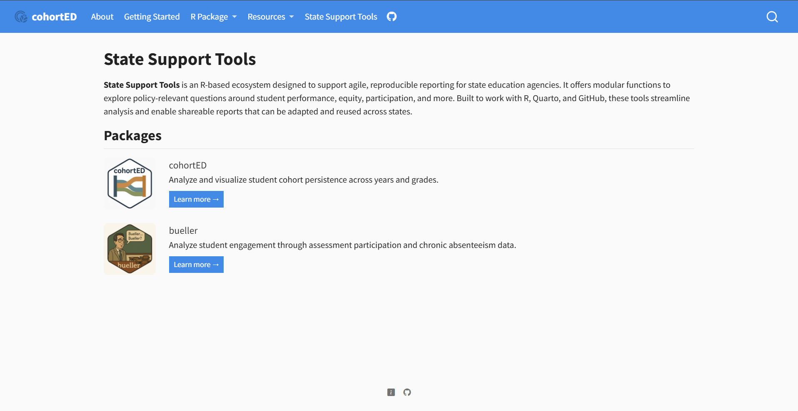
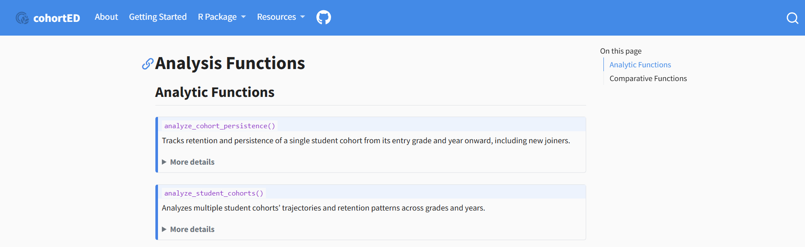
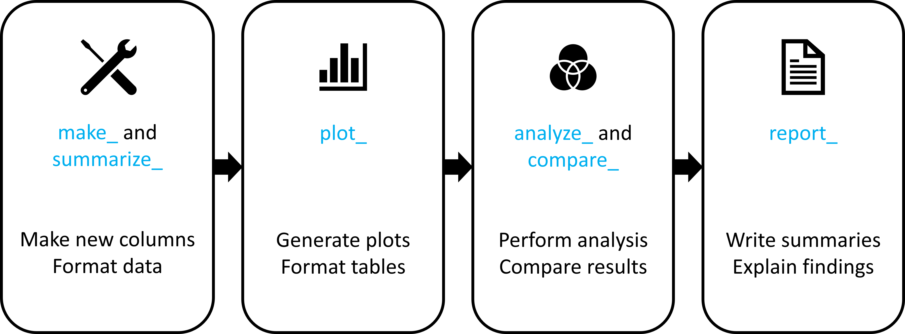

---
format:
  revealjs:
    title-slide: false
    logo: assets/img/cfa_logo_full_color.png
    width: 1600
    height: 900
    preview-links: auto
    scrollable: false
    slide-number: true
    show-slide-number: all
    multiplex: true
    controls: true
    background-transition: fade
    fig-align: center
    center-title-slide: false
    navigation-mode: linear
    theme: [simple, assets/css/presentation-style.scss]
    html-math-method: mathjax
    embed-resources: true
draft: false
---
::: {.title-slide}

{style="max-width: 30%; height: auto; margin-bottom: 1em;"}

# Agile Development to Support State Assessment Analyses
## Intern Update #2
**Brian Harrold**  
July 10, 2025

:::

# Recap: Project Objectives

- Develop modular, reusable R functions to support education data analysis
- Focus on transparency, reproducibility, and efficiency
- Build tools for cohort tracking, participation metrics, and student mobility
- Provide interactive, well-documented outputs for users
- **Shift the role of the state analyst from creator to reviewer**

## {style="display: none;"}

# `cohortED` package

::: {.columns}

::: {.column width="40%"}
{alt="cohortED badge" style="width: 90%"}
:::

::: {.column width="60%"}
- [Quarto Website](https://stat-brain.github.io/cohortED/)
- [GitHub Repository](https://github.com/stat-brain/cohortED)
:::

:::

---

## Significance of `cohortED`

{alt="Package workflow showing data preparation, plotting, analysis, and reporting" style="width: 90%"}

## Recent Improvements

- Enhancing Processes
- Bolster Reporting
- Clarifying Support
- Defining Workflow

## Enhancing Processes

* Longitudinal-population descriptors
  + Describing the population in terms of cohorts
* Persistence-based analysis
  + Visualizing the changes in the population
  
## Visualizing Changes

## Bolster Reporting

* Auto-generated text
  - Compares outputs from analysis functions  
  - Conditionally constructs and combines responses  
* User-oriented logic
  - Suggests plots or tables as needed  
  - Driven by conditional rules  
* Report-ready narrative

## Within the Report

## Clarifying Support

* Cleanly-structured documentation
  + Searchable website with explanations
  + Summaries with collapsible details
  
## Live Example

{alt="Screenshot of online documentation showing Quarto-generated collapsible function descriptions" style="width: 90%"}

  <a href="https://stat-brain.github.io/cohortED/analysis_functions.html" target="_blank"
     style="padding: 0.6em 1.2em; background-color: #004488; color: white; text-decoration: none; border-radius: 6px;">
    Open Live Example ↗
  </a>

## Defining Workflow

* Well-defined structure
  + Additive functionality
  + Streamlined procedures
* Input-structuring tools
  + Facilitate formatting data
  
## Workflow Concept

{alt="Diagram of the cohortED package workflow with four stages: make_ and summarize_, then plot_, then analyze_ and compare_, and finally report_" style="width: 90%"}

## Example Report

*Continue to incorporate feedback*

<iframe src="assets/mobility_report.html" width="100%" height="650px" style="border: 1px solid #ccc;"></iframe>

  <a href="https://stat-brain.github.io/cohortED/example_reports.html" target="_blank" style="font-weight: bold; text-decoration: none; color: #007acc;">
    View Example Reports
  </a>

## Next Steps

* Implement school/district filters
  + Develop support for school/district level transitions
* Document package workflows
  + Supporting users implement functionality
* Expand reporting capabilities
  + Potential for new reports or additional sections
  
## In the Next Two Weeks

* Continue developing functionality and reporting
  + Further Reporting and Narration
  + Expound Performance Comparisons
* Prepare NCME Proposals:
  + Mini (2-hour) Training Session
  + Innovative Demonstration
* Apply Package to Mississippi Assessment Data

## Potential Extensions (Later)

- Alternative Assessments
- Support Services
- Dropout vs. Graduation
- Chronic Absenteeism
- Any other **transition**!

## Desired Feedback

- Frequently asked questions about student mobility
- Related reports or articles to guide future work
- Advice concerning NCME Proposals

