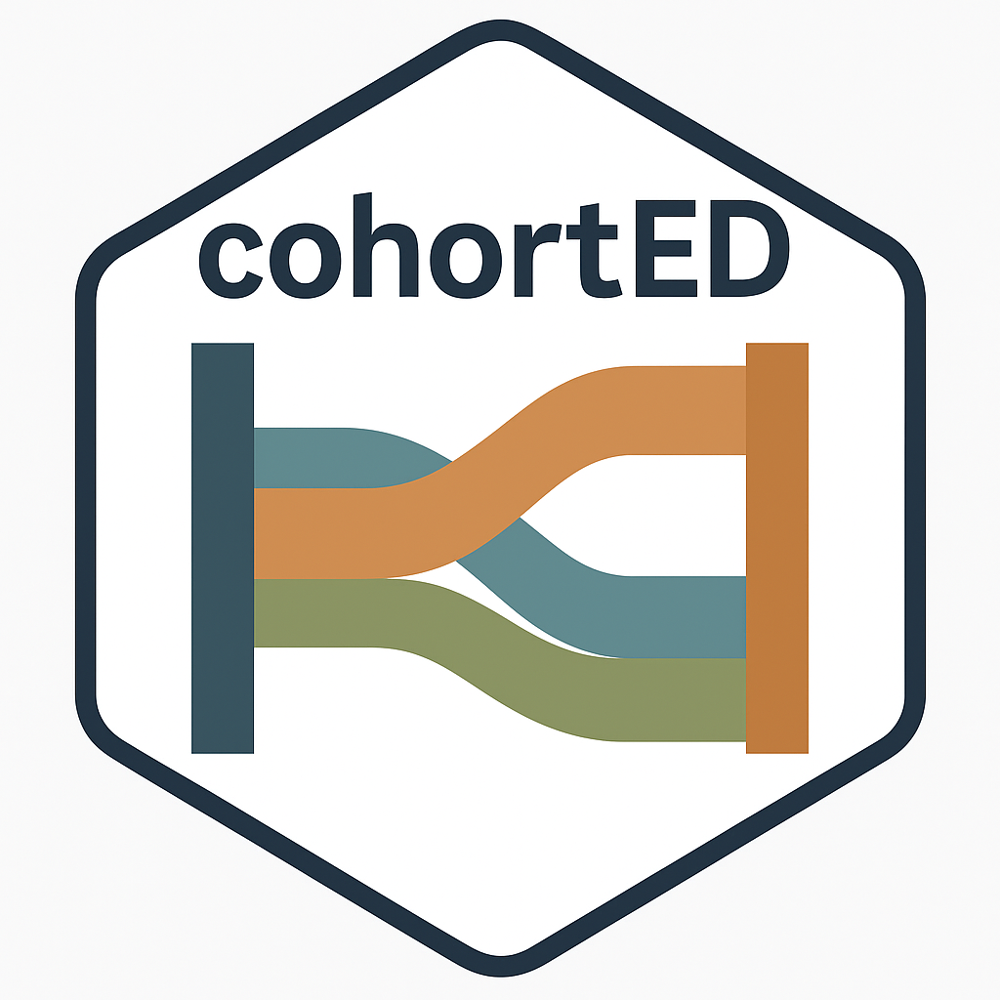

**State Support Tools** is an R-based ecosystem designed to support agile, reproducible reporting for state education agencies. It offers modular functions to explore policy-relevant questions around student performance, equity, participation, and more. Built to work with R, Quarto, and GitHub, these tools streamline analysis and enable shareable reports that can be adapted and reused across states.

## Packages

```{=html}
<div class="d-flex align-items-center mb-4" style="gap: 1.5rem;">
  
  <div>
    <h5 style="margin-bottom: 0.25rem;">cohortED</h5>
    <p style="margin-bottom: 0.5rem;">Analyze and visualize student cohort persistence across years and grades.</p>
    <a href="https://stat-brain.github.io/cohortED/" class="btn btn-sm btn-primary">Learn more →</a>
  </div>
</div>

<div class="d-flex align-items-center mb-4" style="gap: 1.5rem;">
  
  <div>
    <h5 style="margin-bottom: 0.25rem;">bueller</h5>
    <p style="margin-bottom: 0.5rem;">Analyze student engagement through assessment participation and chronic absenteeism data.</p>
    <a href="https://erwx.github.io/bueller/" class="btn btn-sm btn-primary">Learn more →</a>
  </div>
</div>

```
